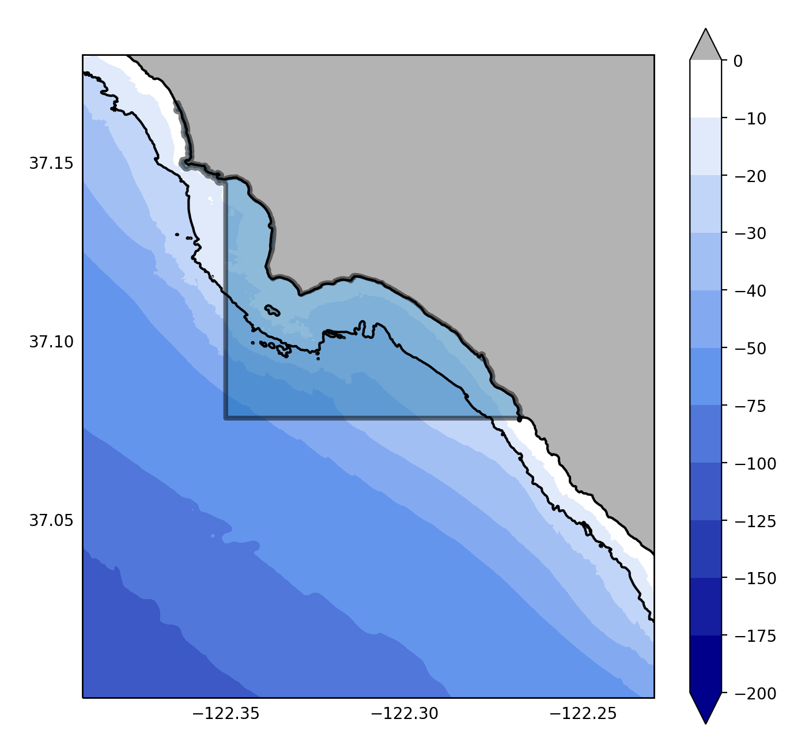

## MPA Dataview Prototype: Ano Nuevo
Author: Patrick Daniel

The prototype code for aggregating data around (and in an MPA). Collections of jupyter notebooks used for data access and analysis for the Ano Nuevo MPA.

Currently there are three notebooks:
1. [ano_nuevo.ipynb](./ano_nuevo.ipynb) - Main Notebook
2. [Ano_nuevo_MOPS_access.ipynb](./Data_Access_Scripts/Ano_nuevo_MOPS_access.ipynb) - For accessing MOPS Wave Model Data
3. [ano_nuevo_SMR_access_bathy.ipynb](./Data_Access_Scripts/ano_nuevo_SMR_access_bathy.ipynb) - For accessing high-res Bathymetry Data

### Scraping `Merged Chlorophyll-a` and `Merged NPP` datasets ###
These data need to be scraped and formatted from the Wimsoft website. A shell script for downloading and a python script for formatting each data set are found at:

[Remote Sensing](./Data/remoteSensingData/)
